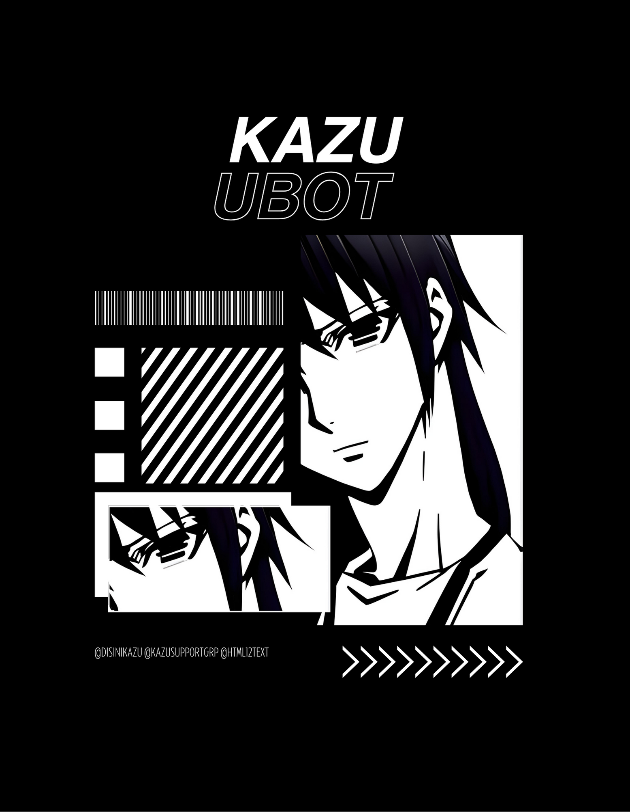

<p align="center">
  
</p>
<h1 align="center">
  <b>ᴋᴀᴢᴜ ꭙ ᴜʙᴏᴛ​</b>
</h1>

<b>A stable pluggable Telegram userbot + Voice & Video Call music bot, based on Telethon and Pyrogram.</b>

<a href="https://github.com/ionmusic/Kazu-Ubot/commits"> </a>
[](https://github.com/ionmusic/Kazu-Ubot)
[](https://GitHub.com/ionmusic/Kazu-Ubot/graphs/commit-activity)
[](https://app.codacy.com/gh/ionmusic/Kazu-Ubot/dashboard)
[](https://github.com/ionmusic/Kazu-Ubot/fork)
[](https://github.com/ionmusic/Kazu-Ubot/stargazers)
----

## Disclaimer

```
Saya tidak bertanggung jawab atas penyalahgunaan bot ini.
Bot ini dimaksudkan untuk bersenang-senang sekaligus membantu anda
mengelola grup secara efisien dan mengotomatiskan beberapa hal yang membosankan.
Gunakan bot ini dengan risiko Anda sendiri, dan gunakan userbot ini dengan bijak.
```

# Tutorial 
- Tutorial to get Redis URL and password - [here.](./resources/extras/redistut.md)
---

<details>
<summary><b>🔗 Deploy di VPS</b></summary>
<br>

### Tutorial Deploy di VPS


• `sudo apt-get install ffmpeg -y`

• `sudo apt-get install mediainfo`

• `pip3 install pytgcalls==3.0.0.dev22`

• `pip install pyUltroid`

 • `git clone https://github.com/ionmusic/Kazu-Ubot`

 • `cd Kazu-Ubot`

 • `pip3 install requirements.txt`
 
 • `pip3 install --no-cache-dir -r re*/st*/op*.txt`

 • `cp .env.sample .env`

 • `nano config.env`
  - isi vars
  - Jika sudah 
  - ketik ctrl + S
  - ctrl + X

 • `screen -S Kazu`

 • `bash startup`

</details>

<p><a href="https://heroku.com/deploy?template=https://github.com/ionmusic/Kazu-Ubot"></a></p>

</details>

# License
[](LICENSE)   
Kazu is licensed under [GNU Affero General Public License](https://www.gnu.org/licenses/agpl-3.0.en.html) v3 or later.

---

## © Credits
* [](https://t.me/UltroidDevs)
* [](https://t.me/xtsea)
* [![[𝐙𝐚𝐞𝐧]ꗈ‽ ](https://img.shields.io/static/v1?label=[𝐙𝐚𝐞𝐧]&message=ꗈ‽&color=critical)](https://t.me/TeleUdahRusak)
* [Lonami](https://github.com/LonamiWebs/) for [Telethon.](https://github.com/LonamiWebs/Telethon)
* [MarshalX](https://github.com/MarshalX) for [PyTgCalls.](https://github.com/MarshalX/tgcalls)

> Kanged by
* [](https://t.me/disinikazu)
